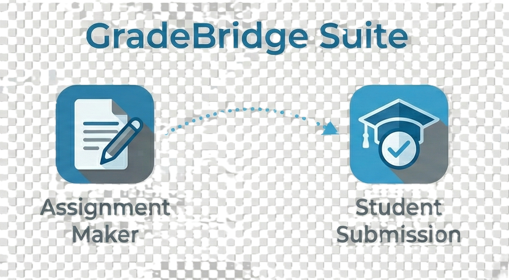

# VeriQAI - Solve the Gradescope Efficiency Gap

VeriQAI provides free, open-source tools for educators. **GradeBridge** eliminates the costly trade-off between student convenience and grading efficiency in Gradescope.

**🚀 Ready to use right now - no signup required:**

## 🎯 The Gradescope Problem We Solve

**Gradescope's AI-assisted grading saves 40-60% of grading time** - but only works with templated PDFs. This forces educators into a costly trade-off:

- ✅ **Use templates** → Get AI efficiency BUT students struggle with rigid formatting (8+ hours instructor setup)
- ✅ **Skip templates** → Easy submissions BUT lose all AI time savings

**The hidden cost:** Thousands of hours lost every semester to this forced choice.

## ✅ GradeBridge: Get Both Benefits

**GradeBridge eliminates the trade-off** - delivering flexible student submissions that generate perfect Gradescope templates automatically.

### [Assignment Maker](https://veriqai.github.io/GradeBridge-Assignment-Maker/) 
**For Educators** • Create Gradescope-optimized assignments in 15 minutes (not 8 hours)
- Professional LaTeX rendering built-in
- **Exports JSON that students load in Student Submission app**
- **Auto-generates perfect Gradescope PDF templates**
- Zero manual template creation required

### [Student Submission](https://veriqai.github.io/GradeBridge-Student-Submission/)
**For Students** • **Load assignments from Assignment Maker** and generate Gradescope-ready PDFs
- **Imports JSON files created by instructors using Assignment Maker**
- Guided interface prevents formatting errors
- **AI usage tracking built-in for academic integrity**
- **PDFs match instructor Gradescope templates perfectly**

---

## 🔥 The Impact: Quantified Results

**Time Savings:**
- **Assignment creation:** 8 hours → 15 minutes (3,100% improvement)
- **Grading efficiency:** Full 40-60% Gradescope AI savings preserved
- **Student submission success:** Near 100% (vs. frequent format failures)

**Quality Improvements:**
- Zero time spent on formatting troubleshooting
- Consistent, professional submissions every time
- Academic integrity through AI usage documentation
- Maximum Gradescope AI efficiency realized

---

## 🚀 Quick Start: Eliminate the Trade-Off Today

**Educators:**
1. Visit [Assignment Maker](https://veriqai.github.io/GradeBridge-Assignment-Maker/)
2. Create assignment with LaTeX support (15 minutes vs 8 hours)
3. Export JSON for students + PDF template for Gradescope
4. Upload PDF to Gradescope - all regions auto-configured

**Students:**  
1. Get assignment JSON from instructor  
2. Visit [Student Submission](https://veriqai.github.io/GradeBridge-Student-Submission/)
3. Load assignment → Complete work → Download Gradescope-ready PDF
4. Submit with confidence - format guaranteed to work

**Result:** Full Gradescope AI efficiency + zero submission friction.

---

## 💡 Why This Matters

**Before GradeBridge:**
- Choose templates → 8 hours setup + student formatting struggles
- Skip templates → Easy submissions but zero AI grading benefits
- Either way, educators lose time and efficiency
*([See detailed technical analysis with Gradescope documentation references →](WORKFLOW_MOTIVATION.md))*

**With GradeBridge:**
- Students get flexible, guided submission experience
- Instructors get perfect Gradescope templates automatically
- Full AI-assisted grading efficiency preserved
- No trade-offs required

---

## 🎓 Perfect For

**STEM Educators:** Complex LaTeX equations rendered professionally, no template creation burden

**Large Course Instructors:** Hundreds of consistent submissions, maximum Gradescope AI efficiency  

**Any Educator Using Gradescope:** Who wants the full 40-60% grading time savings without the template setup nightmare

---

## 🔧 Technical Excellence

**Built for Gradescope Integration:**
- PDFs formatted specifically for Gradescope optimization
- Answer regions and numbering perfectly coordinated
- Professional headers and consistent layouts
- Tested with courses of 500+ students

**Privacy & Accessibility:**
- 100% client-side processing (your data never leaves your browser)
- No accounts or subscriptions required
- Works on any device with a modern browser
- MIT License - free for all educational use

---

## 📖 Learn More

**Want the full technical analysis?**
📖 **[Technical analysis: Why Gradescope forces this trade-off & how we solve it →](WORKFLOW_MOTIVATION.md)**

**Ready to get involved?**
- 🚀 **Try it now:** [Assignment Maker](https://veriqai.github.io/GradeBridge-Assignment-Maker/) | [Student Submission](https://veriqai.github.io/GradeBridge-Student-Submission/)
- 🐛 [Report issues or request features](https://github.com/orgs/VeriQAi/repositories)
- 💻 Contribute to our open-source mission
- ⭐ Star our repos if they save you time

**Explore our repositories:** [github.com/VeriQAi](https://github.com/VeriQAi)

---

## About VeriQAI

We're educators and technologists who got tired of the artificial trade-offs imposed by educational technology platforms. Our mission: eliminate the friction points that prevent educators from realizing the full potential of AI-assisted teaching tools.

**GradeBridge is our flagship solution** - proving that you don't have to choose between student experience and instructor efficiency. Sometimes the best educational technology is the bridge that makes existing powerful tools work better.

*More educational workflow solutions in development • Follow us to stay updated*

---

**Built by educators, for educators. Eliminate the Gradescope trade-off today.**
