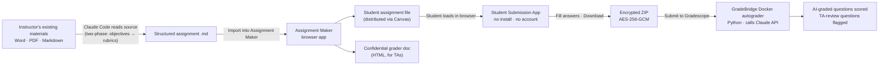

# VeriQAi — Free, Open-Source AI Tools for Educators

VeriQAi publishes free, open-source, privacy-first AI tools for educators. Every tool runs entirely in your browser — no accounts, no subscriptions, no student data sent to our servers. Two tools are available today:

| Tool | What it does | Live App |
|---|---|---|
| **GradeBridge** | Structured engineering assignments with AI autograding via Gradescope — using your own autograder, not Gradescope's built-in AI | [Assignment Maker](https://veriqai.github.io/GradeBridge-Assignment-Maker/) · [Student Submission](https://veriqai.github.io/GradeBridge-Student-Submission/) |
| **MATLAB Grader Problem Generator** | Generates complete MATLAB Grader problems from a single learning objective in minutes | [Open App](https://veriqai.github.io/MatlabGraderProblemGenerator/) |

---

## GradeBridge

GradeBridge is a system for creating structured engineering course assignments with AI autograding via Gradescope. It replaces ad-hoc PDF submissions with a structured workflow: students submit an encrypted ZIP archive, and a Docker-based autograder — running in your own Gradescope account and calling the Anthropic Claude API — scores answers automatically against your rubric.

GradeBridge does **not** use Gradescope's built-in AI features. It does **not** use Gradescope PDF templates or template regions. No student data passes through any VeriQAi server at any point.

### How the pipeline works

```mermaid
flowchart LR
    A["Instructor's existing materials\nWord · PDF · Markdown"] -->|"Claude Code reads source\n(two-phase: objectives → rubrics)"| B["Structured assignment .md"]
    B -->|"Import into Assignment Maker"| C["Assignment Maker\nbrowser app"]
    C --> D["Student assignment file\n(distributed via Canvas)"]
    C --> E["Confidential grader doc\n(HTML, for TAs)"]
    D -->|"Student loads in browser"| F["Student Submission App\nno install · no account"]
    F -->|"Fill answers · Download"| G["Encrypted ZIP\nAES-256-GCM"]
    G -->|"Submit to Gradescope"| H["GradeBridge Docker autograder\nPython · calls Claude API"]
    H --> I["AI-graded questions scored\nTA-review questions flagged"]
```

### Step by step

1. **Instructor:** Run Claude Code against your existing lab manual or project description (Word, PDF, or Markdown — no reformatting needed). Claude Code generates a structured assignment `.md` file in two phases: first you confirm the learning objectives, then rubrics are written.
2. **Instructor:** Import the `.md` into the [Assignment Maker](https://veriqai.github.io/GradeBridge-Assignment-Maker/) browser app. Review and adjust questions, point values, and rubrics. Export — this produces the student assignment file (distribute via Canvas), a PDF, and a confidential grader document (HTML, for TAs).
3. **Student:** Open the [Student Submission App](https://veriqai.github.io/GradeBridge-Student-Submission/) in a browser (no account, no install). Load the assignment file, fill in answers, click **Download for Gradescope**. Submit the single ZIP archive to Gradescope.
4. **Gradescope:** GradeBridge's Docker autograder runs. It calls the Anthropic Claude API directly, scores AI-graded questions automatically, and flags TA-review questions for human review.

### Submission types

| Type | What the student does | How it is graded |
|---|---|---|
| Text | Types an answer | TA reviews |
| Image | Uploads a photo or screenshot | TA checks against grader checklist |
| AI Graded: Binary | Yes/no answer with brief justification | Autograder scores automatically |
| AI Graded: Short / Medium / Long | ~50 / ~100 / ~150-word response | Autograder scores against required-elements rubric |

### What you need

- A Gradescope account with a course
- An Anthropic API key (used by the Docker autograder on Gradescope)
- Claude Code (for assignment generation from your existing materials)

### Repositories

- [VeriQAi/VeriQAI-GradeBridge](https://github.com/VeriQAi/VeriQAI-GradeBridge) — system docs and CCAssignmentMaker tools
- [VeriQAi/GradeBridge-Assignment-Maker](https://github.com/VeriQAi/GradeBridge-Assignment-Maker) — Assignment Maker app
- [VeriQAi/GradeBridge-Student-Submission](https://github.com/VeriQAi/GradeBridge-Student-Submission) — Student Submission app

---

## MATLAB Grader Problem Generator

### [Open App →](https://veriqai.github.io/MatlabGraderProblemGenerator/)

Creating a single MATLAB Grader problem from scratch means writing four separate artifacts — problem description, reference solution, learner template, and test cases — each with MATLAB Grader's exacting syntax requirements. The test cases alone (guard conditions, diagnostics, R2025b API) can take an experienced instructor an hour or more per problem.

Enter a learning objective. The app proposes calibrated problems across Easy / Medium / Hard difficulty for Script or Function problem types. Select the ones you want — all four artifacts are generated in sequence with live review at each step. Download as a named ZIP ready to paste directly into MATLAB Grader.

**Key facts:**

- Requires your own Anthropic API key (get one at [console.anthropic.com](https://console.anthropic.com))
- Generating and fully developing 4 problems costs approximately **$0.05–$0.10** with Claude Sonnet
- R2025b-compliant MATLAB Grader syntax out of the box
- No signup · MIT License · Runs entirely in your browser

**Repository:** [VeriQAi/MatlabGraderProblemGenerator](https://github.com/VeriQAi/MatlabGraderProblemGenerator)

---

## About VeriQAi

We are educators and engineers who build tools to remove friction from AI-assisted teaching and assessment. Our tools work alongside the platforms you already use — Gradescope, MATLAB Grader, Canvas — rather than replacing them.

All tools are MIT-licensed, free forever, and designed so that your data and your students' data never leave your machine.

[Report an issue or request a feature](https://github.com/orgs/VeriQAi/repositories)
